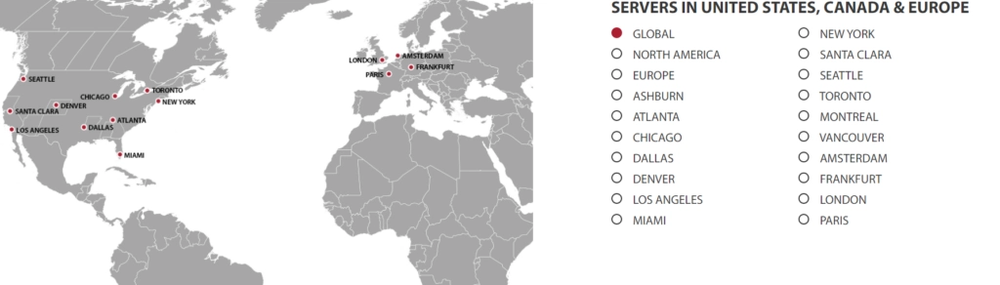

# GTHost Review: Global Dedicated Server Hosting

Looking to reach customers on the opposite side of the world without sacrificing speed? Need a hosting solution that puts your servers exactly where your audience is? GTHost might be the answer you're looking for.

This global hosting provider operates 17+ data centers worldwide, letting you build custom dedicated server plans based on your exact storage and location needs. Whether you're expanding internationally or need better performance for distant users, GTHost offers the infrastructure to make it happen—with instant setup, unlimited bandwidth, and full root access.

---

## What is GTHost?

GTHost (GLOBALTELEHOST Corp.) was established in 2012 with one clear mission: deliver optimal, affordable hosting services worldwide. Over the past decade, they've built out an impressive network of data centers spanning multiple continents.

What sets GTHost apart is flexibility. Instead of forcing you into pre-packaged plans, they let you customize your server configuration based on your actual requirements. Need more storage in Singapore? Want a server in London with specific CPU specs? You build it, you get it.

## Global Data Center Coverage

GTHost's 17+ data centers are strategically positioned across:

- **North America**: Multiple US locations plus Canada
- **Europe**: UK, Netherlands, Germany, France
- **Asia**: Singapore, Hong Kong, Japan, India
- **Australia**: Sydney
- **Other regions**: Continuing expansion

This geographic spread means you can position your servers close to your target audience, dramatically reducing latency and improving load times. If your customers are in Mumbai, why host in Miami?

## Security That Actually Protects

Your data represents months or years of work. It's the backbone of your online presence and business operations. GTHost takes this seriously.

The platform includes DDoS protection as standard, shielding your servers from the attacks that take down unprotected sites. All data remains encrypted through SSL software, keeping your information secure in transit and at rest.

👉 [Want rock-solid security for your global server network? See how GTHost protects your infrastructure](https://cp.gthost.com/en/join/72c7e6b2fc118929f9ede2978f008806)

GTHost also maintains strict policies against malicious activity—you're protected from attacks, and you can't launch them either. It's a cleaner, safer hosting environment for everyone.

## Customer Support When You Need It

Switching hosting providers can feel overwhelming, especially in those first few days when you're still figuring everything out. GTHost's 24/7 support team is available through multiple channels:

- **Live chat**: Instant responses for urgent issues
- **Phone support**: Talk directly to a human
- **Email support**: Detailed technical assistance with category-specific addresses

No matter your timezone or when problems arise, someone's ready to help.

## Key Features Worth Noting

### Unlimited Bandwidth

Worried about traffic spikes pushing you over bandwidth limits? GTHost eliminates that concern entirely. No caps, no overage charges, no throttling when your site goes viral. Your bandwidth scales with your success, not against it.

### Instant Setup (Really)

Forget waiting days for server provisioning. GTHost gets your dedicated server up and running in 5-15 minutes after purchase. That's faster than most pizza deliveries. You can literally start building your online presence the same day you sign up.

### Full Root Access

Your server, your rules. GTHost provides complete root access, giving you total control over configurations, software installations, and system modifications. No arbitrary restrictions, no need to submit tickets for basic changes. You're in the driver's seat.

## Hosting Plans and Pricing

GTHost primarily focuses on dedicated servers with a build-your-own approach. You select:

- **Storage capacity**: From basic to enterprise-level
- **Server location**: Any of their 17+ global data centers  
- **RAM and CPU**: Scaled to your workload
- **Bandwidth**: Unlimited on all plans

Pricing starts around $59/month and scales based on your configuration. While they don't publish a fixed menu of plans, this flexibility means you're not paying for features you don't need or compromising because of features you can't get.

## Do We Recommend GTHost?

Yes, particularly for dedicated servers with global reach.

If you need servers in multiple geographic locations, want control over your exact specifications, and value fast deployment, GTHost delivers. The combination of worldwide data centers, customizable plans, and unlimited bandwidth makes it especially suitable for:

- International businesses with distributed audiences
- SaaS platforms requiring low latency globally
- Content delivery networks and streaming services
- E-commerce sites targeting multiple regions
- Agencies managing client infrastructure across continents

The platform's flexibility means you can start small in one location and expand to others as your needs grow.

## Frequently Asked Questions

**Does GTHost offer a free trial?**

Not exactly. GTHost offers 1-10 day trial periods at reduced rates rather than completely free trials. The terms can be confusing, so review their [terms of service](https://cp.gthost.com/en/page/terms?_ga=2.179979619.656792361.1655286311-1729963139.1655286311) carefully to understand what's included.

**How much does GTHost cost?**

Since you build custom plans, pricing varies based on your selections. Basic dedicated servers start at approximately $59/month. Higher specifications, additional locations, or premium features increase the price accordingly.

**What support options does GTHost provide?**

GTHost offers 24/7 support through live chat, phone, and email. They provide category-specific email addresses for billing versus technical issues, helping route your requests to the right team faster.

**Does GTHost offer dedicated servers?**

Yes, dedicated servers are GTHost's primary offering. You can select your server location and storage capacity, then customize the rest of your configuration. All dedicated server plans include unlimited bandwidth.

---

## Final Thoughts

GTHost delivers what many businesses actually need: global server infrastructure without the complexity of managing it yourself. The 17+ data center locations mean you can position servers exactly where your audience is, delivering the speed users expect regardless of their location.

Unlimited bandwidth removes a common scaling bottleneck, while instant setup means you're not waiting around to launch. The combination of DDoS protection and SSL encryption provides security without additional configuration headaches.

The customizable approach to server plans is both a strength and potential weakness. You get exactly what you need, but you'll need to understand your requirements well enough to build the right configuration. For those with clear infrastructure needs, this flexibility is invaluable. 

👉 [Ready to deploy faster servers closer to your global audience? Discover why GTHost is perfect for international hosting needs](https://cp.gthost.com/en/join/72c7e6b2fc118929f9ede2978f008806)
